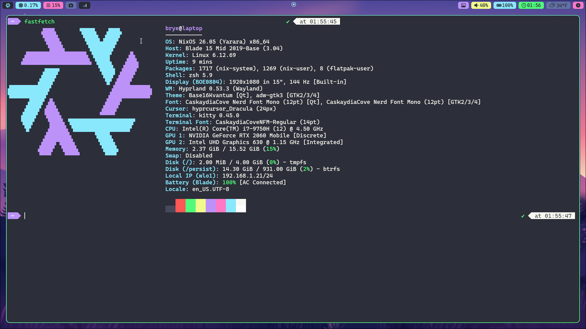

# Brye's NixOS

Quick install notes for this [NixOS](https://nixos.wiki/) flake. Using [disko](https://github.com/nix-community/disko), [impermanence](https://github.com/nix-community/impermanence), [sops-nix](https://github.com/Mic92/sops-nix) and [home-manager](https://github.com/nix-community/home-manager).



## Fresh install (NixOS ISO)

Replace `<hostname>` with the host folder under [nixos/hosts](./nixos/hosts).

### Reformatting Existing Machine

Format drive and install NixOS using disko-install: 
```sh
sudo nix --extra-experimental-features "nix-command flakes" \
  run "github:nix-community/disko/latest#disko-install" \
  -- --flake github:bryewalks/nixos#<hostname> \
  --disk main /dev/<disk>
```

```sh
sudo reboot
```

** You may need to format drive with disko first then nixos-install depending on RAM:
```sh
sudo nix --extra-experimental-features "nix-command flakes" \
  run github:nix-community/disko \
  -- --mode destroy,format,mount \
  --flake github:bryewalks/nixos#<hostname>
```

```sh
sudo nixos-install --flake github:bryewalks/nixos#<hostname>
```

```sh
sudo reboot
```

Continue with the [Post install](#post-install) steps.

### New Machine Setup

#### Prerequisites
- Create a disk config using [Disko](https://github.com/nix-community/disko) for new machine at nixos/hosts/\<hostname>\/disko.nix [example](./nixos/hosts/laptop/disko.nix). 
- Optionally create a secrets.yaml file at nixos/hosts/\<hostname>\/secrets.yaml with github ssh key (sshKey) and user password (hashedPassword) [example](./nixos/hosts/laptop/secrets.yaml). 
- Additional details on secrets management can be found [here](#secrets-management)


Format and mount drive with disko:
```sh
sudo nix --extra-experimental-features "nix-command flakes" \
  run github:nix-community/disko \
  -- --mode destroy,format,mount \
  --flake github:bryewalks/nixos#<hostname>
```

Clone repo into mounted disk
```sh
sudo git clone https://github.com/bryewalks/nixos /mnt/tmp/nixos
```

Generate hardware config
```sh
sudo nixos-generate-config --no-filesystems \
  --show-hardware-config \
  | sudo tee /mnt/tmp/nixos/nixos/hosts/<hostname>/hardware.nix \
  > /dev/null
```

Install NixOS
```sh
sudo nixos-install --flake /mnt/tmp/nixos#<hostname>
```

* Hardware config will need to be commited at this point or regenerated post initial login.

```sh
sudo reboot
```

Continue with the [Post install](#post-install) steps.

### Post install

Copy sops keys to persistent storage
```sh
sudo cp /path/to/sops/keys.txt /persist/system/var/lib/sops/keys.txt
```

Rebuild
```sh
sudo nixos-rebuild switch --flake github:bryewalks/nixos#<hostname>
```

Clone NixOS repo
```sh
git clone git@github.com:bryewalks/nixos
```


## Secrets Management

This repo uses [sops-nix](https://github.com/Mic92/sops-nix) with [age](https://github.com/FiloSottile/age). Secrets live in per-host `secrets.yaml` files and are decrypted using an age key at build/activation time.

Paths used by this repo:
- Age key file: `/persist/system/var/lib/sops/keys.txt` (configured in `nixos/modules/sops/default.nix`)
- Per-host secrets file: `nixos/hosts/<hostname>/secrets.yaml` (set via `sops.defaultSopsFile` in each host)

Secrets expected in `secrets.yaml`:
- `sshKey`: private key contents for `/home/brye/.ssh/id_ed25519`
- `hashedPassword`: hashed password string used by `users.users.brye.hashedPasswordFile`

### Age key setup

1) Generate a new age key (store where sops-nix expects it):
```sh
mkdir -p /persist/system/var/lib/sops
age-keygen -o /persist/system/var/lib/sops/keys.txt
```

2) Print the public key (use this in `secrets.yaml` recipients if needed):
```sh
age-keygen -y /persist/system/var/lib/sops/keys.txt
```

3) Create or edit a secrets file with an explicit recipient:
```sh
sops --age <publicKey> nixos/hosts/<hostname>/secrets.yaml
```

### Generating a hashed password
```sh
openssl passwd -6
```

### Extra commands

Check flake for errors (no build):
```sh
sudo nix --extra-experimental-features "nix-command flakes" flake check --no-build
```

Check specific host:
```sh
sudo nix --extra-experimental-features "nix-command flakes" eval .#nixosConfigurations.<host>.config.system.build.toplevel.drvPath
```
