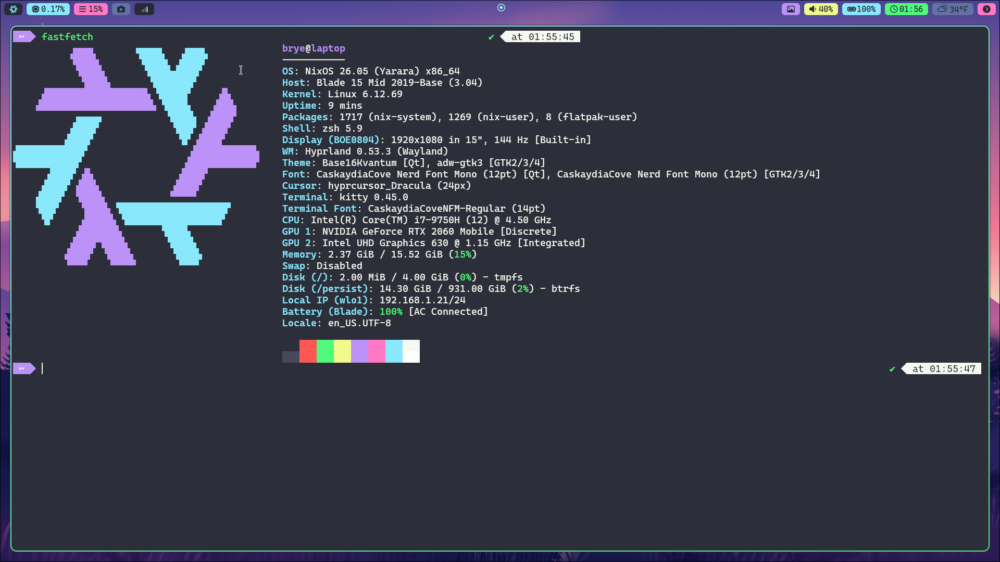

# Brye's NixOS

Install notes for this [NixOS](https://nixos.org/) flake. Built on [flake-parts](https://github.com/hercules-ci/flake-parts) with [den](https://github.com/denful/den) and [flake-file](https://github.com/vic/flake-file), using [disko](https://github.com/nix-community/disko), [impermanence](https://github.com/nix-community/impermanence), [sops-nix](https://github.com/Mic92/sops-nix) and [home-manager](https://github.com/nix-community/home-manager).



## Layout

Everything lives under [modules/](./modules), loaded by import-tree — every file is a flake-parts module. `flake.nix` itself is generated (see [Flake inputs](#flake-inputs-flake-file)).

- `modules/base/` — foundation every host includes (boot, networking, nix, security)
- `modules/hosts/<hostname>/` — self-contained host: registration (`den.hosts`), aspect composition, disko export; `_config/` holds the machine's hardware reality (disko, hardware, gpu, filesystem, secrets)
- `modules/users/` — user entities (account, home-manager basics, user secrets)
- `modules/features/` — everything else, as den aspects
- `modules/packages/` — custom packages, overlaid onto nixpkgs and exported as flake packages (`nix build .#dracula-cursors`)

## Fresh install (NixOS ISO)

Replace `<hostname>` with a host folder under [modules/hosts](./modules/hosts).

### Reformatting an existing host

Format the drive and install in one step with disko-install:
```sh
sudo nix --extra-experimental-features "nix-command flakes" \
  run "github:nix-community/disko/latest#disko-install" \
  -- --flake github:bryewalks/nixos#<hostname> \
  --disk main /dev/<disk>
```

```sh
sudo reboot
```

Alternatively, format and install as separate steps (avoids disko-install building in the ISO's tmpfs):
```sh
sudo nix --extra-experimental-features "nix-command flakes" \
  run github:nix-community/disko \
  -- --mode destroy,format,mount \
  --flake github:bryewalks/nixos#<hostname>
```

```sh
sudo nixos-install --flake github:bryewalks/nixos#<hostname>
```

```sh
sudo reboot
```

Continue with [Post install](#post-install).

### New host setup

#### Prerequisites

Create `modules/hosts/<hostname>/` with:
- `default.nix` — registers the host (`den.hosts`) with its capabilities (`themeName`, optionally `storageRoot`), exports its disko config (`flake.diskoConfigurations`), and composes its aspects (`base`, `features`, ...) ([example](./modules/hosts/laptop/default.nix))
- `_config/default.nix` — `networking.hostName`, `sops.defaultSopsFile`, host options ([example](./modules/hosts/laptop/_config/default.nix))
- `_config/disko.nix` — disk layout ([example](./modules/hosts/laptop/_config/disko.nix))
- `_config/secrets.yaml` — optional; ssh key (`sshKey`) and user password (`hashedPassword`), see [Secrets management](#secrets-management)

#### Install

Format and mount the drive with disko:
```sh
sudo nix --extra-experimental-features "nix-command flakes" \
  run github:nix-community/disko \
  -- --mode destroy,format,mount \
  --flake github:bryewalks/nixos#<hostname>
```

Clone the repo into the mounted disk:
```sh
sudo git clone https://github.com/bryewalks/nixos /mnt/tmp/nixos
```

Generate the hardware config:
```sh
sudo nixos-generate-config --no-filesystems \
  --show-hardware-config \
  | sudo tee /mnt/tmp/nixos/modules/hosts/<hostname>/_config/hardware.nix \
  > /dev/null
```

Install:
```sh
sudo nixos-install --flake /mnt/tmp/nixos#<hostname>
```

Commit the hardware config now, or regenerate it after first login.

```sh
sudo reboot
```

Continue with [Post install](#post-install).

### Post install

Copy the sops age key to persistent storage:
```sh
sudo cp /path/to/sops/keys.txt /persist/system/var/lib/sops/keys.txt
```

Rebuild (activates sops secrets, including the hashed password):
```sh
sudo nixos-rebuild switch --flake github:bryewalks/nixos#<hostname>
```

Set `mySystem.isPasswordConfigured = true;` in `modules/hosts/<hostname>/_config/default.nix` and rebuild again. This switches the user from `initialPassword = "password"` to the sops-managed `hashedPassword` — until then the default plaintext password remains active.
```sh
sudo nixos-rebuild switch --flake github:bryewalks/nixos#<hostname>
```

Clone the repo for day-to-day use:
```sh
git clone git@github.com:bryewalks/nixos
```

## Flake inputs (flake-file)

`flake.nix` is generated by [flake-file](https://github.com/vic/flake-file) — never edit it by hand. Each module declares the inputs it consumes via `flake-file.inputs` (e.g. [gaming](./modules/features/gaming/default.nix) declares `steam-config-nix`); core inputs no single feature owns (nixpkgs, den, home-manager) live in [modules/den.nix](./modules/den.nix), which also wires the flake-file dendritic flakeModule. Deleting a feature removes its input on the next regeneration.

After adding, removing, or changing an input declaration:
```sh
nix run .#write-flake
```

Then lock the new input and rebuild as usual (`nh os switch --update` is unaffected by flake-file otherwise). Commit the regenerated `flake.nix` together with the module change — `nix flake check` fails if they drift.

If `flake.nix` is ever lost, restore it from git, or regenerate without an evaluable flake:
```sh
nix-shell https://github.com/vic/flake-file/archive/main.tar.gz \
  -A flake-file.sh --run write-flake
```

## Secrets management

[sops-nix](https://github.com/Mic92/sops-nix) with [age](https://github.com/FiloSottile/age). Secrets live in per-host `secrets.yaml` files, decrypted at build/activation time.

Paths:
- Age key file: `/persist/system/var/lib/sops/keys.txt` (set in `modules/features/sops/default.nix`)
- Per-host secrets: `modules/hosts/<hostname>/_config/secrets.yaml` (via `sops.defaultSopsFile` in each host's `_config/default.nix`)

Expected secrets:
- `sshKey` — private key contents for `/home/brye/.ssh/id_ed25519`
- `hashedPassword` — hashed password used by `users.users.brye.hashedPasswordFile`

### Age key setup

Generate a key where sops-nix expects it:
```sh
mkdir -p /persist/system/var/lib/sops
age-keygen -o /persist/system/var/lib/sops/keys.txt
```

Print the public key (for `secrets.yaml` recipients):
```sh
age-keygen -y /persist/system/var/lib/sops/keys.txt
```

Create or edit a secrets file with an explicit recipient:
```sh
sops --age <publicKey> modules/hosts/<hostname>/_config/secrets.yaml
```

### Generating a hashed password
```sh
openssl passwd -6
```

## Extra commands

Check the flake for errors (no build):
```sh
nix flake check --no-build
```

Evaluate a specific host:
```sh
nix eval .#nixosConfigurations.<hostname>.config.system.build.toplevel.drvPath
```

Generate a hardware config on a non-NixOS machine (requires nix):
```sh
sudo nix --extra-experimental-features "nix-command flakes" shell nixpkgs#nixos-install-tools -c nixos-generate-config --show-hardware-config > hardware.nix
```
